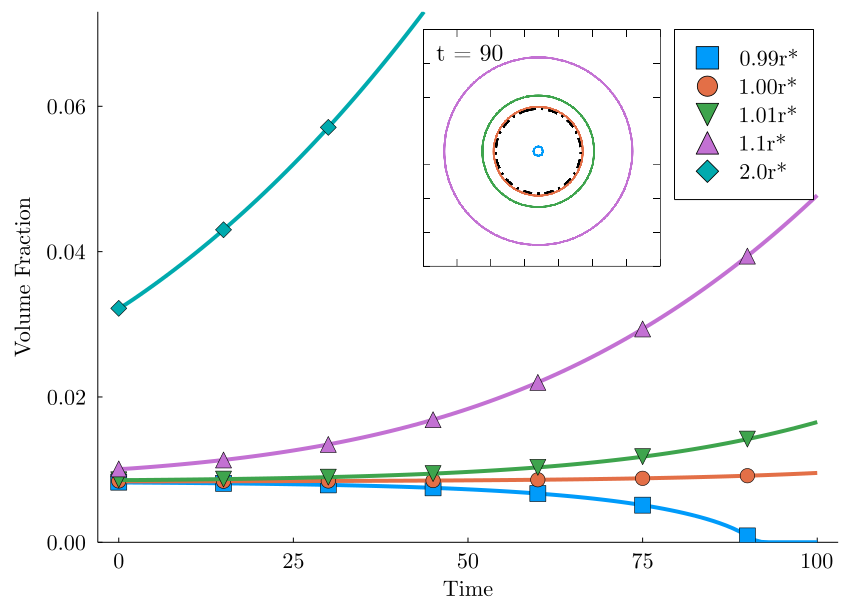
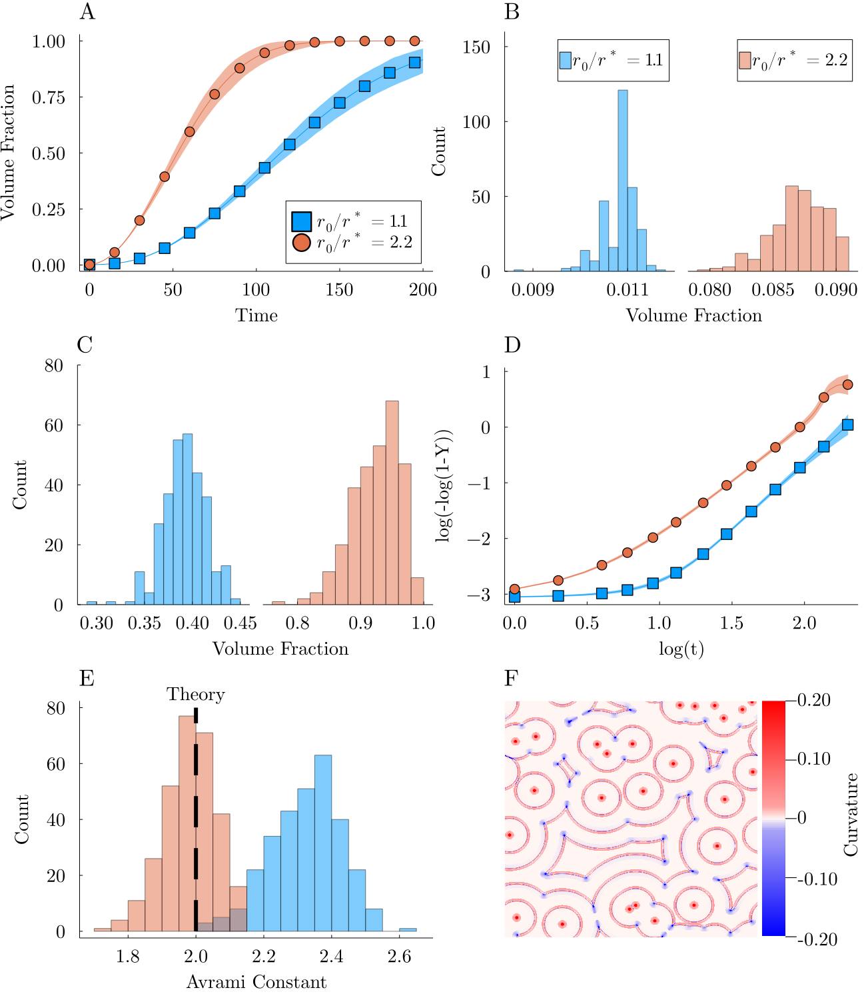
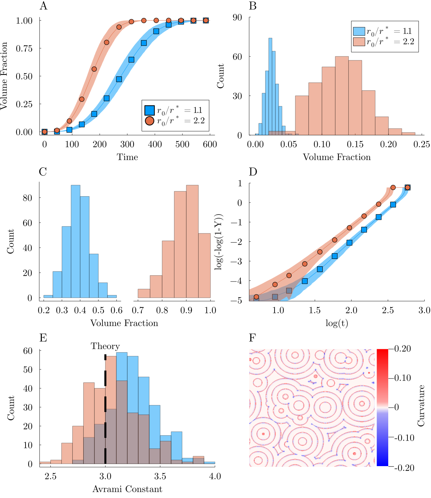

# PF_Nucleation_Benchmark_Julia

## Introduction and Motivation
This repository represents a phase field benchmark described in PF Hub: https://pages.nist.gov/pfhub/benchmarks/benchmark8.ipynb/

The paper that was written describing this repository is published in the IMMI journal and is available here: https://arxiv.org/abs/2210.16866

## Methods
This benchmark was solved and explored using Julia code with CUDA parallelization and finite difference solvers.
The code and data are stored in this repository.

## Code and Data
curv_nuc.jl is the pf code used to develop all the raw data found in this repository.
Each part has a folder that corresponds to the data created for that part.
In parts 2 and 3 there are additional folders where the data for different values of (inital radius / critical radius) are stored.
There is also an additional folder labelled phi_domains which has the data for the full phi array at the time labelled in the title of the file.

## Results

Figure 1: Phase-field results for transformed fraction of a single seed (Problem I ) versus time. The inset
shows the interface (φ = 0.5) at t = 90, for the four cases with ρ ≤ 1.1, as solid lines and the initial radius
as black dash-dotted line.

Figure 2: Phase-field results of the site-saturation simulations (Problem II ) with two distinct critical radius
values ρ = 1.1 and ρ = 2.2 combining 300 separate instances for each with different random location
of the 25 initial seeds: (A) Transformed fraction versus time, showing global average (line and symbols)
and statistical distribution (shaded background), (B) Volume fraction distribution at t = 20, (C) Volume
fraction distribution at t = 100, (D) Avrami log-log plot, showing global average (line and symbols) and
statistical distribution (shaded background), (E) Distribution of Avrami exponents fitted individually to
the 300 simulations, (F) Spatiotemporal map showing the curvature of the particles at the interface as
they grow at t = 0, 40, 80, 120, 160, 200 for one simulation with ρ = 1.1.

Figure 3: Phase-field results of the continuous nucleation simulations (Problem III ) with two distinct
critical radius values ρ = 1.1 and ρ = 2.2 combining 300 separate instances for each with different
random location of the 25 initial seeds: (A) Transformed fraction versus time, showing global average
(line and symbols) and statistical distribution (shaded background), (B) Volume fraction distribution at
t = 100, (C) Volume fraction distribution at t = 250, (D) Avrami log-log plot, showing global average
(line and symbols) and statistical distribution (shaded background), (E) Distribution of Avrami exponents
fitted individually to the 300 simulations, (F) Spatiotemporal map showing the curvature of the particles
at the interface as they grow at t = 0, 50, 100, 150, 200, 250, 300 for one simulation with ρ = 1.1.
